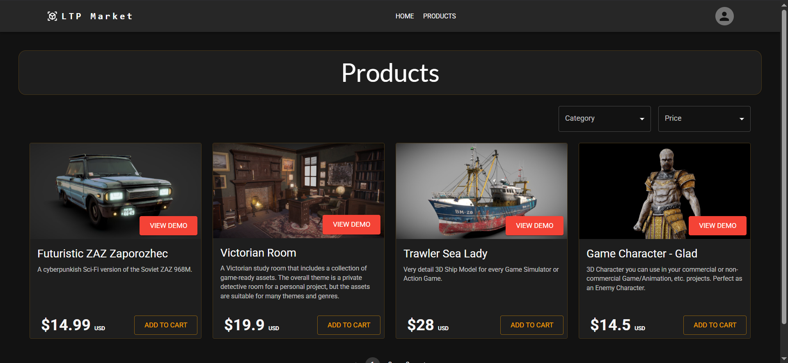

# Los Tres Primos Market

> Coderhouse Backend Final Project — E-commerce platform for 3D digital assets

[](https://nodejs.org/)
[](https://www.typescriptlang.org/)
[](https://mongoosejs.com/)
[](https://opensource.org/licenses/ISC)
[](https://coderbackend-ltp.onrender.com/)
[](https://coderbackend-ltp.onrender.com/apidocs)

---

## Live Deployments



| Provider | URL | Notes |
|---|---|---|
| Render | <https://coderbackend-ltp.onrender.com/> | GitHub OAuth works here |

> Free-tier deployment may have a cold-start delay of ~30 seconds on the first request.

---

## Table of Contents

- [Overview](#overview)
- [Tech Stack](#tech-stack)
- [Features](#features)
- [User Roles](#user-roles)
- [Project Structure](#project-structure)
- [Local Setup](#local-setup)
- [Available Scripts](#available-scripts)
- [Docker](#docker)
- [API Routes](#api-routes)
- [View Routes](#view-routes)
- [API Documentation](#api-documentation)
- [Live Deployments](#live-deployments)

---

## Overview

Los Tres Primos Market is a full-stack e-commerce application for buying and selling 3D digital assets. The backend is built with Express and TypeScript and exposes a REST API consumed by both a Handlebars SSR layer and a React SPA frontend. It includes role-based access control, shopping carts, a purchase/order system, real-time features via WebSockets, and an integrated Swagger API explorer.

---

## Tech Stack

| Layer | Technology |
|---|---|
| Runtime | Node.js 18 |
| Language | TypeScript (source in `src/`, compiled to `dist/`) |
| Framework | Express 4 |
| Database | MongoDB + Mongoose + connect-mongo sessions |
| Auth | Passport.js — local strategy + GitHub OAuth2 |
| Real-time | Socket.IO |
| Email | Nodemailer |
| API Docs | Swagger UI + swagger-jsdoc |
| Logging | Winston |
| Styling (SSR) | Tailwind CSS + Handlebars |
| Frontend SPA | React 18, Vite, MUI, React Router, Framer Motion |
| Testing | Mocha + Chai + Supertest |
| Containerization | Docker + Docker Compose |

---

## Features

- 🔐 Register, login, logout — local credentials or GitHub OAuth
- 🛍️ Browse products with pagination, category filter, and price sort
- 🛒 Full cart management — add, update quantity, remove, or clear items
- 💳 Purchase flow that generates tickets and persists orders
- 📧 Email confirmation on purchase (Nodemailer)
- 👥 Role-based access control across all endpoints
- 🧑‍💼 Admin user manager — promote, demote, or delete users
- 🔄 Real-time product list updates via WebSockets
- 📄 Document upload for premium user verification
- 🔑 Password recovery via email token
- 🧪 Mocking endpoint to seed random products (Faker.js)
- 📊 Logger test endpoint to exercise all Winston log levels

---

## User Roles

| Role | Permissions |
|---|---|
| `user` | Browse products, manage own cart, purchase, access chat view |
| `premium` | Everything a user can do, plus create and delete own products |
| `admin` | Full CRUD on all products, manage all users, access admin views |

> Premium users cannot delete products they do not own. Admins bypass ownership checks.

---

## Project Structure

```
.
├── src/                     # TypeScript source (backend)
│   ├── App.ts               # Express app entry point
│   ├── config/              # Passport configuration
│   ├── controllers/         # Route handler logic
│   ├── DAO/                 # Data access — Mongo classes, models, DTOs, factory
│   ├── middlewares/         # Auth, error handling, logging, multer
│   ├── routes/              # Express routers
│   ├── services/            # Business logic and custom errors
│   ├── utils/               # Logger, Swagger, Nodemailer, Faker, etc.
│   └── views/               # Handlebars templates (SSR)
├── dist/                    # Compiled JavaScript output (run from here)
├── frontend_react/          # React + Vite SPA source
│   └── src/
│       ├── components/      # Reusable UI components
│       └── pages/           # Route-level page components
├── public/                  # Static assets (CSS, JS, images, uploads)
├── Dockerfile
├── docker-compose.yml
└── package.json
```

---

## Local Setup

### Prerequisites

- Node.js 18+
- A MongoDB Atlas cluster (or local MongoDB instance)
- A GitHub OAuth App (for GitHub login)
- An SMTP mail account (e.g. Gmail App Password)

### 1. Install dependencies

```bash
npm install
```

### 2. Configure environment variables

Create a `.env` file at the project root with the following variables:

```env
# Server
PORT=8080
NODE_ENV=DEVELOPMENT           # Set to PRODUCTION for production builds
PROD_URL=https://your-prod-url.com

# Session
SESSION_SECRET=your_session_secret

# Database (MongoDB Atlas)
DAO=MONGO
MONGO_USER=your_mongo_user
MONGO_PASSWORD=your_mongo_password
MONGO_URL=your_cluster.mongodb.net/your_db_name

# GitHub OAuth (optional — needed for GitHub login)
GITHUB_CLIENT_ID=your_github_client_id
GITHUB_CLIENT_SECRET=your_github_client_secret

# Email (Nodemailer)
MAIL_USER=your@email.com
MAIL_PASS=your_app_password

# Admin credentials for integration tests
ADMIN_MAIL=admin@example.com
ADMIN_PASS=your_admin_password
```

### 3. Run the server

```bash
npm start
```

The server starts at `http://localhost:8080` (or the value of `PORT`).

### 4. Run tests

```bash
npm test
```

Tests are run with Mocha + Supertest against the compiled `dist/tests/Supertest.test.js`.

---

## Available Scripts

| Command | Description |
|---|---|
| `npm start` | Install deps and start the server from `dist/App.js` |
| `npm run dev` | Start the server in watch mode with nodemon |
| `npm run ts` | Watch and compile TypeScript (`tsc-watch`) |
| `npm run tw` | Watch and compile Tailwind CSS |
| `npm test` | Run integration test suite with Mocha |

> For active development, run `npm run ts` and `npm run dev` concurrently in two terminals so TypeScript changes are picked up automatically.

---

## Docker

The repository ships with a `Dockerfile` and `docker-compose.yml` that spin up three coordinated services:

| Service | Description |
|---|---|
| `react` | Runs the React Vite dev server on port 3000 |
| `typescript` | Runs `tsc-watch` to compile TypeScript source in real time |
| `nodejs` | Runs the Express API server on port 8080 |

### Start all services

```bash
docker-compose up
```

The API will be accessible at `http://localhost:8080` and the React dev server at `http://localhost:3000`.

---

## API Routes

### Products — `/api/products`

| Method | Path | Auth Required | Description |
|---|---|---|---|
| `GET` | `/api/products` | — | List products (paginated, filterable, sortable) |
| `GET` | `/api/products/:pid` | — | Get a single product |
| `POST` | `/api/products` | Admin or Premium | Create a product |
| `PUT` | `/api/products/:pid` | Admin | Update a product |
| `DELETE` | `/api/products/:pid` | Admin or Premium (owner) | Delete a product |

### Carts — `/api/carts`

| Method | Path | Auth Required | Description |
|---|---|---|---|
| `POST` | `/api/carts` | — | Create a new cart |
| `GET` | `/api/carts/:cid` | Cart owner | Get cart contents |
| `PUT` | `/api/carts/:cid` | Cart owner | Replace all cart products |
| `DELETE` | `/api/carts/:cid` | Cart owner | Clear the cart |
| `POST` | `/api/carts/:cid/product/:pid` | Cart owner | Add a product to cart |
| `PUT` | `/api/carts/:cid/product/:pid` | Cart owner | Update product quantity |
| `DELETE` | `/api/carts/:cid/product/:pid` | Cart owner | Remove a product from cart |
| `POST` | `/api/carts/:cid/purchase` | Cart owner | Purchase cart contents |

### Users — `/api/users`

| Method | Path | Auth Required | Description |
|---|---|---|---|
| `POST` | `/api/users/register` | — | Register a new user |
| `POST` | `/api/users/login` | — | Log in with email/password |
| `GET` | `/api/users/logout` | — | Log out current session |
| `GET` | `/api/users/github` | — | Initiate GitHub OAuth login |
| `GET` | `/api/users/githubcallback` | — | GitHub OAuth callback |
| `GET` | `/api/users/current` | Logged in | Get current session user data |
| `GET` | `/api/users/cart` | Logged in | Get current session cart ID |
| `POST` | `/api/users/recovery` | — | Send password recovery email |
| `PUT` | `/api/users/recovery` | — | Validate recovery token |
| `DELETE` | `/api/users/recovery` | — | Update password via recovery token |
| `GET` | `/api/users/premium/:uid` | — | Toggle user role to/from premium |
| `POST` | `/api/users/:uid/documents` | Logged in (self) | Upload verification documents |
| `GET` | `/api/users/:uid/tickets` | Logged in (self) | Get orders for a user |
| `GET` | `/api/users` | Admin | List all users |
| `PATCH` | `/api/users/:uid` | Admin | Update a user's role |
| `DELETE` | `/api/users/:uid` | Admin | Delete a specific user |
| `DELETE` | `/api/users` | Admin | Delete all inactive users |

### Other

| Method | Path | Description |
|---|---|---|
| `GET` | `/mockingproducts` | Generate and insert 100 mock products (Faker.js) |
| `GET` | `/loggerTest` | Trigger all Winston log levels on the server |
| `GET` | `/apidocs` | Swagger UI |

---

## View Routes

| Path | Auth Required | Description |
|---|---|---|
| `/` | — | Home / landing page |
| `/products` | — | Product catalog (SSR) |
| `/carts/:cid` | Cart owner | Shopping cart view |
| `/chat` | User role | Real-time chat |
| `/realtimeproducts` | Admin | Live product management |
| `/users` | Admin | User administration panel |
| `/orders` | Logged in | Order history |
| `/recovery` | — | Password recovery form |

---

## API Documentation

- **Swagger UI:** <https://coderbackend-ltp.onrender.com/apidocs>
- **Postman Online Docs:** <https://documenter.getpostman.com/view/19344400/2s9XxvTEr6>
- **Postman Collection JSON:** <https://drive.google.com/file/d/1EtcL6qChZSYwAKGpKFmodre4eP-Kj_87/view?usp=sharing>
